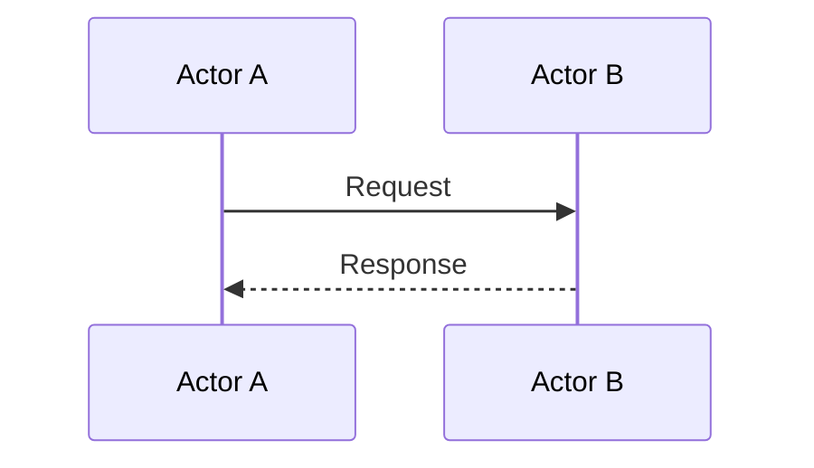

# Workflow: `WorkflowName`

<!--
AI: Map out each step with the user before writing the diagram.
Ask: trigger, actors, happy path, failure paths, state changes.
Update workflows/readme.md index after creating this file.
-->

## Trigger

<!-- What initiates this workflow? User action, event, schedule, external signal? -->

## Actors

<!-- Who/what participates: users, systems, services, components? -->

-

## Happy Path

## Failure Paths

| Condition | Handling |
|-----------|---------|
| | |

## State Changes

<!-- What data or state is created, modified, or deleted during this workflow? -->

-

## Notes

<!-- Edge cases, business rules, timing constraints. -->
